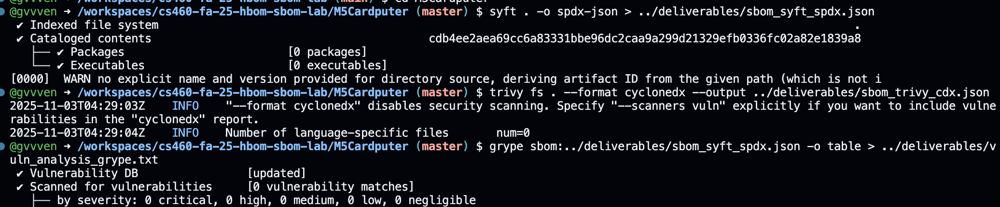

(Used git clone https://github.com/m5stack/M5Cardputer.git)
To start off, a SBOM or software bill of materials is everything in the code, which incldues libraries, packages, dependencies to see any open source or third part risks. HBOM which is the hardware counterpart is everything on the actual board of the device so any chips, sensors or physical modules to trace hardware background and any potential counterfeit or tampering risks. Using both of them, we can easily see the full supply-chain visisbilty.

Using these commands that were listed in the assignment, we were able to see that for Syft, there was 0 component detected and for Trivy, there was 0. Some of the differences include that Syfts way of doing it includes packages field and basic metadata, while trivy's format focuses on vulnerabillty scanning and produced a different schema format.

For vulnerabilties, the command grype sbom:../deliverables/sbom_syft_spdx.json -o table > ../deliverables/vuln_analysis_grype.txt
was used and the output from the command was No vulnerabilities found which means that the repository contains firmware and configuration files but no libraries or package manifests. This means that Grype did not detect any known CVE's and doing further research this seems to be common for embedded or SDK-based projects.

Overall, this lab really taught me and demonstrated how SBOMs and HBOMs really complement each other in any type of supply chain assurance. Using the provided tools, being Syft and Trivy which gave different SBOM views of the same repository and Grype which told us that there are no immediate CVEs. The HBOM analysis also showcased that even without software vulnerabilities, insecure hardware or SDK dependencies can really be a danger to a device. By combining the two, many organizations in the work force can better detect risks across the entire device lifecycle.